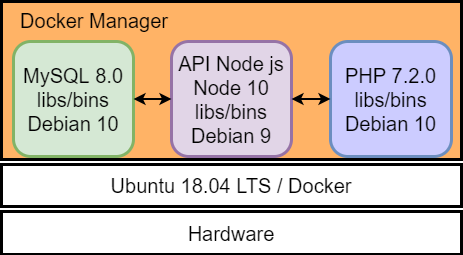

# Sistemas Distribuídos - App Agenda 
Projeto criado com o objetivo de apresentar de forma prática um exemplo de sistema distribuído. </br>
Diretórios:</br>
&nbsp;&nbsp; <b>api</b> - API node js</br>
&nbsp;&nbsp; <b>api/db</b> - Banco de dados MySQL</br>
&nbsp;&nbsp; <b>website</b> - Site em PHP e HTML</br>

Todo projeto foi criado em Ubuntu 18.04 LTS </br>
Após instalar o Ubuntu faça a instalação do Docker e adicione o seu usúario ao grupo docker:

```
sudo apt -y install docker.io
sudo usermod -aG docker $USER
```

Reinicie a sua sessão do Linux para atualizar os grupos do seu usuário.

<h3> Como Rodar </h3>

Entre no diretório <b>./api</b> no terminal e execute os comandos:

```
npm install
npm install --save-dev nodemon express mysql body-parser
```

Com isso, as dependências Node seram instaladas. A versão utilizada é Node 10.


<h3> Como construir as imagens </h3>
Acesse a pasta raíz do projeto e construa cada imagem (MySQL, Node API e PHP):

```
docker build -t mysql-8  -f api/db/Dockerfile .
docker build -t node-10 -f api/Dockerfile .
docker build -t php-7 -f website/Dockerfile .
```


<h3> Como rodar os containers </h3>
Na pasta raíz do projeto, execute um comando de cada vez:

```
docker run -d -v $(pwd)/api/db/data:/var/lib/mysql --rm --name mysql-container mysql-8
docker run -d -v $(pwd)/api:/home/node/app -p 9001:9001 --link mysql-container --rm --name node-container node-10
docker run -d -v $(pwd)/website:/var/www/html -p 80:80 --link node-container --rm --name php-container php-7
```


<h3> Como restaurar o banco </h3>
Na pasta raíz do projeto, execute o comando que irá carregar os registros da base de dados:

```
docker exec -i mysql-container mysql -uroot -p1234 <  api/db/agenda.sql
```





<h3>Referências</h3>
Introdução ao Docker em 22 minutos </br>
https://www.youtube.com/watch?v=Kzcz-EVKBEQ </br>
https://github.com/programadorabordo/docker-introducao </br>
